PCA and clustering on a single cell RNA-seq dataset
===================================================

Here are some simple examples on how to run PCA/Clustering on a single cell RNA-seq dataset.

The dataset used is single-cell RNA-seq data from mouse embryonic development from Deng. et al. Science 2014, Vol. 343 no. 6167 pp. 193-196, "Single-Cell RNA-Seq Reveals Dynamic, Random Monoallelic Gene Expression in Mammalian Cells"

All data you need is available in the course uppmax folder with subfolder: `scrnaseq_course/data/mouse_embryo/`

### Data processing:

First read in the data and define colors/symbols for plotting

``` r
DATA<-read.table("data/mouse_embryo/rpkms_Deng2014_preinplantation.txt")
nS<-ncol(DATA) #number of samples
nG<-nrow(DATA) #number of genes
```

We want to create a vector of colors for each embryonic stage, but also symbols for each individual embryo. To get the stage and embry definitions for each sample we split the names either by "\_" or "."

``` r
sample.names<-colnames(DATA)
head(sample.names,10)
```

    ##  [1] "MIIoocyte_1"     "MIIoocyte_2"     "MIIoocyte_3"    
    ##  [4] "zy_1"            "zy_2"            "zy_3"           
    ##  [7] "zy_4"            "early2cell_0r.1" "early2cell_0r.2"
    ## [10] "early2cell_1.1"

``` r
stage<-unlist(lapply(strsplit(sample.names,"_"),function(x) x[1]))
embryo<-unlist(lapply(strsplit(sample.names,"\\."),function(x) x[1]))
    
stages<-unique(stage)
# have 11 different stages, define 11 colors for those.
coldef.stage<-c("black","red","green","blue","cyan","magenta",
                "yellow","pink","gray","brown","orange")
names(coldef.stage) <- stages
col.stage <- coldef.stage[stage]
    
embryos<-unique(embryo)
# have 42 different embryos, use the first default 18 symbols rotated 
# and we will never have a combination of the same color/symbol
pchdef.embryo<-c(1:18,1:18,1:6)
names(pchdef.embryo)<-embryos
pch.embryo<-pchdef.embryo[embryo]
```

### PCA

There are some custom functions in PCA\_RNAseq\_functions.R that are called run.pca, pca.plot, pca.contribution.plot and pca.loadings.plot. Have a look at the file for documentation of the scripts.

``` r
# first run pca, should take about 1 min.
# should always be run on logged values, and you need to transpose the matrix 
PC<-prcomp(log2(t(DATA)+1))

# the prcomp class has slots:
# sdev - standard deviation of pcs
# rotation - gene loadings
# x - rotated data onto the first nS pcs

# now we can plot the first 2 PCs
plot(PC$x[,1:2],col=col.stage,pch=pch.embryo,main="first PCA")
legend("topleft",stages,col=coldef.stage,pch=16,cex=0.5,bty='n')
```

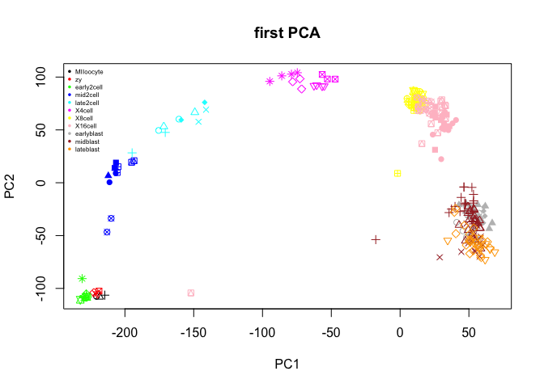

``` r
# and plot with the first 5 PCs
plot(data.frame(PC$x[,1:5]),col=col.stage,pch=pch.embryo,main="first PCA")
```

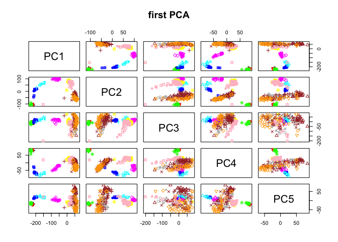

#### Color the cells by number of detected genes

``` r
library(plotrix)
```

    ## Warning: package 'plotrix' was built under R version 3.4.3

``` r
nDet <- apply(DATA,2,function(x) sum(x>1))
col.nDet <- color.scale(nDet,c(0,1,1),c(1,1,0),0)
plot(data.frame(PC$x[,1:5]),col=col.nDet,pch=pch.embryo,main="first PCA")
```

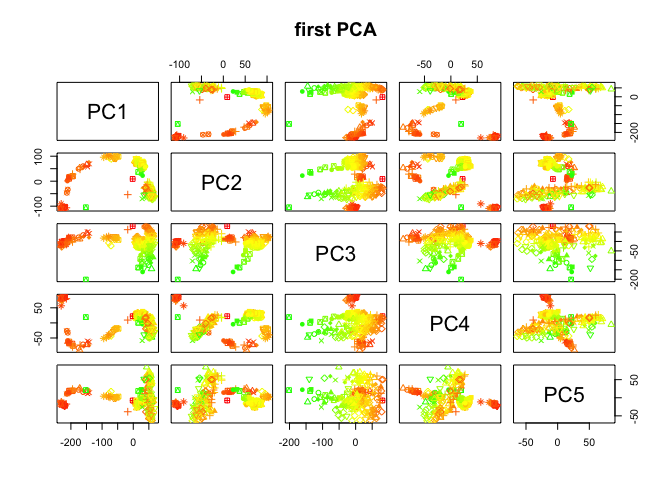

#### Plot contribution to variance per PC

``` r
# variance per pc
vars<- PC$sdev^2
# proportion of variance
vars<- vars/sum(vars)
# plot first 15 pcs
barplot(vars[1:15],names.arg=1:15)
```


#### Plot top loadings for PC 1-5

``` r
# top gene loadings for the first 5 components

# calculate contribution to each pc
aload <- abs(PC$rotation[,1:5])
contr<- sweep(aload, 2, colSums(aload), "/")

nPlot <- 5 #number of genes top plot per pc.
par(mfrow=c(5,2),mar=c(2,2,1,1),oma=c(1,5,1,1))
for (i in 1:5) {
    top<-order(PC$rotation[,i],decreasing=T)[1:nPlot]
    bottom<-order(PC$rotation[,i],decreasing=F)[1:nPlot]
    barplot(contr[top,i],main=sprintf("genes on pos axis PC%d",i),
            ylab="% contr",las=2,horiz=T)
    barplot(contr[bottom,i],main=sprintf("genes on neg axis PC%d",i),
            ylab="% contr",las=2,horiz=T)
}
```

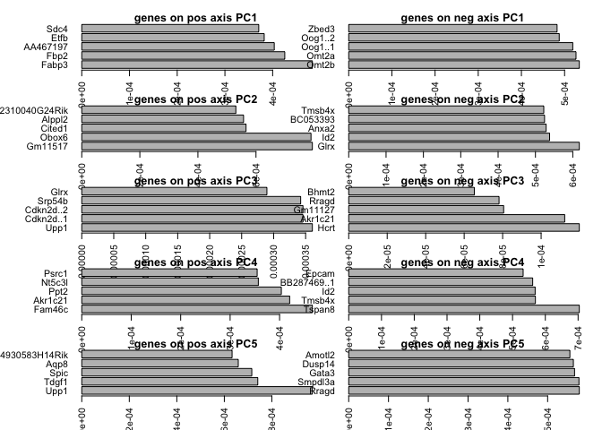

#### Plot PCA together with the top loading genes, a biplot

We can either plot the top genes on each PC, or take the genes with the furthest distance from origo.

``` r
# first the top genes.  
rot<-PC$rotation[,1:2]
#multiplication factor based on scale of pcs.
mult <- min(
  (max(PC$x[,2]) - min(PC$x[,2])/(max(rot[,2])-min(rot[,2]))),
  (max(PC$x[,1]) - min(PC$x[,1])/(max(rot[,1])-min(rot[,1])))
)
rot <- rot*mult

# select top 5 genes per pc
selG <- unique(as.vector(apply(rot,2,function(x) tail(order(abs(x)),5))))

plot(PC$x[,1:2],col=col.stage,pch=pch.embryo,main="first PCA")
text(rot[selG,1],rot[selG,2],rownames(rot)[selG],cex=1,col="black") 
```

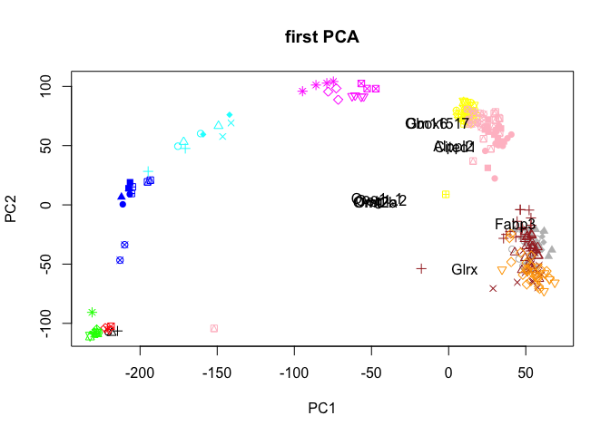

``` r
# or select ones with longest distance from origo, here 10 top genes
dist<-rot[,1]^2+rot[,2]^2
selG<-order(dist,decreasing=T)[1:10]
      
plot(PC$x[,1:2],col=col.stage,pch=pch.embryo,main="first PCA")
text(rot[selG,1],rot[selG,2],rownames(rot)[selG],cex=1,col="black") 
```


Have a look at the plots you created, what type of variance does the different PCs capture? How many PCs are informative? Do the genes that contribute to each PC make sense?

### Coloring in PCA

We can also add in coloring by any color we want, lets use the expression of the top genes for PC1 & PC2. Here I have used the function color.scale from the `plotrix` package to define a color range with green-yellow-red scale.

``` r
# load the library
library(plotrix)

# get first/last gene from PC1 & 2
n1<-names(sort(PC$rotation[,1]))
n2<-names(sort(PC$rotation[,2]))
plotgenes<-c(tail(n1,1),n1[1],tail(n2,1),n2[1])

par(mfrow=c(2,2)) # define plotting of 4 plots (2 rows, 2 columns)  
for (gene in plotgenes) {
   expr<-log2(as.numeric(DATA[gene,]+1))
     # color scale with red for high values, yellow intermeidate,  green for low.
     col<-color.scale(expr,c(0,1,1),c(1,1,0),0)
     plot(PC$x[,1:2],col=col,pch=16,main=gene)
}
```

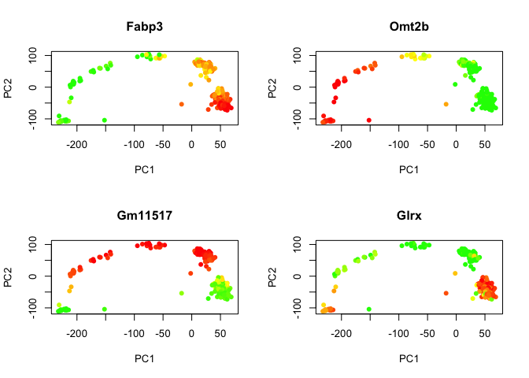

### Different settings in PCA

You ran PCA on log transformed rpkms and by default it does centering of the data, test doing it without logging and witout centering and compare the results.

``` r
PC.nolog<-prcomp(t(DATA))
PC.nocenter<-prcomp(t(log2(DATA+1)),center=FALSE)
PC.nocenterlog<-prcomp(t(DATA),center=FALSE)
    
# plot all 4 PCA settings
par(mfrow=c(2,2))
plot(PC$x[,1:2],col=col.stage,pch=pch.embryo,main="first PCA")
legend("topleft",stages,col=coldef.stage,pch=16,cex=0.3,bty='n')
plot(PC.nolog$x[,1:2],col=col.stage,pch=pch.embryo,main="no logging")
plot(PC.nocenter$x[,1:2],col=col.stage,pch=pch.embryo,main="no centering")
plot(PC.nocenterlog$x[,1:2],col=col.stage,pch=pch.embryo,main="no centering, no logging")
```

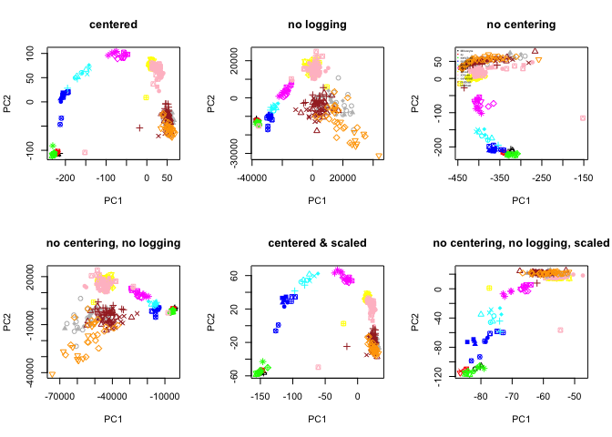

What are the main differences, why is that do you think?

PCA based on blastocyst stages only
-----------------------------------

The different embryonic stages separated out quite well in the first PCA, but at the blastocyst stage the cells do not separate by timepoint, but that may also be expected since they are starting to form different cell layers that should group together. Try running a PCA with only those cells and see if you can get them to separate.

Functions for running pca, plotting pca, loadings, biplots etc are included in a file with some custom functions `data/mouse_embryo/PCA_RNAseq_functions.R` so that we do not have to rewrite the code all the time for the plots we want to produce.

``` r
# load the custom PCA functions
source("data/mouse_embryo/PCA_RNAseq_functions.R")
    
# get the index for all the blastocyst cells
blasto<-grep("blast",colnames(DATA))
PC.blast<-run.pca(DATA[,blasto])
    

pca.plot(PC.blast,col=col.stage[blasto],pch=pch.embryo[blasto],main="Blastocyst PCA")
legend("topleft",stages[9:11],col=coldef.stage[9:11],pch=16,cex=0.5,bty='n')
```

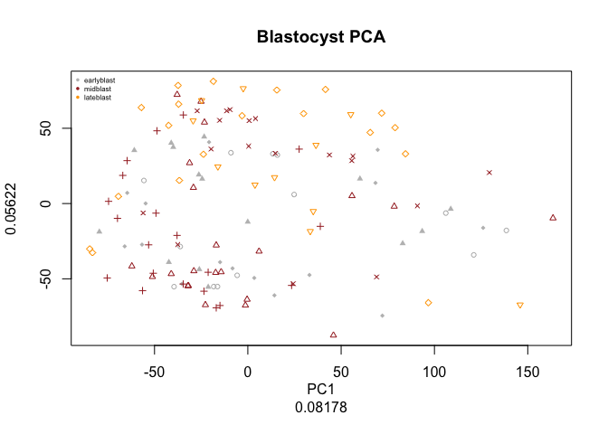

``` r
pca.plot(PC.blast,col=col.stage[blasto],pch=pch.embryo[blasto],main="Blastocyst PCA",selpc=1:5)
```


``` r
# plot by detected genes
pca.plot(PC.blast,col=col.nDet[blasto],pch=pch.embryo[blasto],main="Blastocyst PCA",selpc=1:5)
```

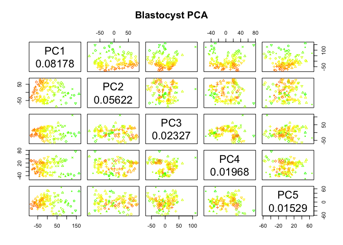

``` r
# pca contribution
pca.contribution.plot(PC.blast)
```

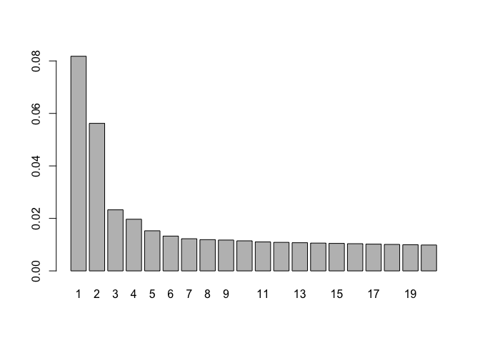

``` r
# loadings
pca.loadings.plot(PC.blast,nPlot=10)
```

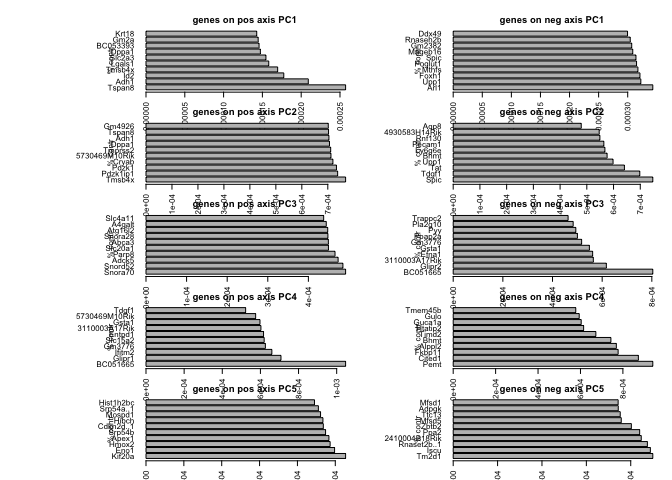

``` r
# biplot
par(mfrow=c(1,1),oma=c(2,2,2,2))
pca.plot(PC.blast,col=col.stage[blasto],pch=pch.embryo[blasto],main="Blastocyst PCA",selpc=1:2)
plot.pca.biplot(PC,add=T,selpc=1:2,nPlot=10)
```

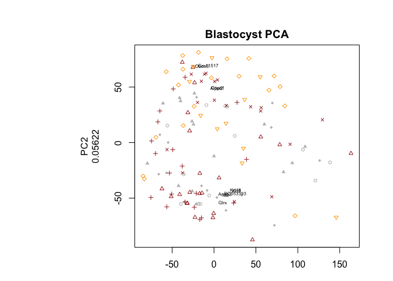

Have a look at the PCA with blastocyst cells, do you see clear separation of the timepoints at any of the PCs? Any other aspects that separates the data? Anything that you think may be related to lineages instead?

### Lineage specifying genes

Since we know some genes that separates the 2 cell layers, we can "cheat" and plot their expression in the pca.

``` r
plotgenes <- c("Sox2","Tdgf1","Pdgfra","Gata2","Gata3","Dab2")

# define plotting of 4 plots (2 rows, 2 columns)    
par(mfrow=c(3,2),mar=c(1,1,2,1)) 

for (gene in plotgenes) {
   expr<-log2(as.numeric(DATA[gene,blasto]+1))
     # color scale with red for high values, yellow intermeidate,  green for low.
     col<-color.scale(expr,c(0,1,1),c(1,1,0),0)
     plot(PC.blast$x[,1:2],col=col,pch=16,main=gene)
}
```

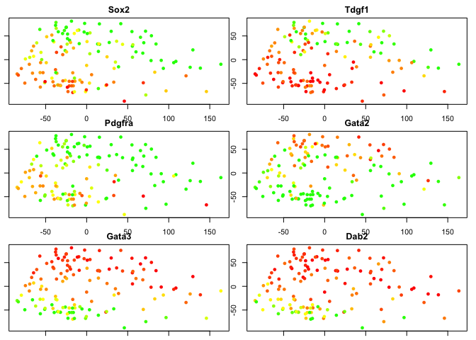

``` r
# plot the same genes onto the PCA with all cells
for (gene in plotgenes) {
   expr<-log2(as.numeric(DATA[gene,]+1))
     # color scale with red for high values, yellow intermeidate,  green for low.
     col<-color.scale(expr,c(0,1,1),c(1,1,0),0)
     plot(PC$x[,1:2],col=col,pch=16,main=gene)
}
```

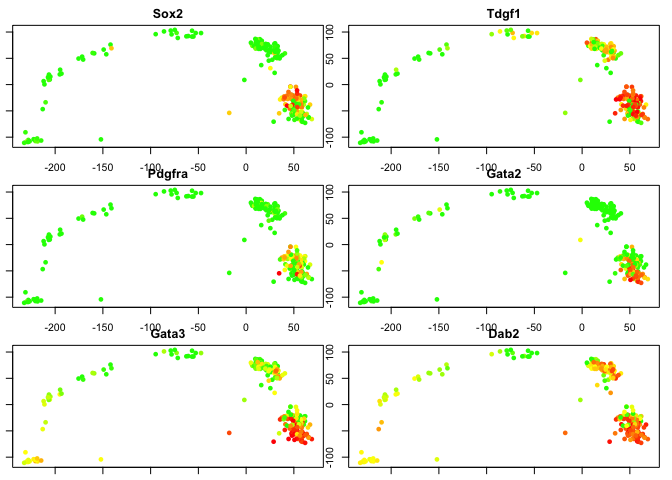

### Clustering

Now, lets try some different clustering methods. Quite often, clustering is based on pairwise correlations. So let's start with calculating pairwise correlations for all samples. Default for the R-function cor is Pearson correlation.

``` r
C<-cor(log2(DATA+1))

# Run clustering based on the correlations, where the distance will 
# be 1-correlation, e.g. higher distance with lower correlation.
dist.corr<-as.dist(1-C) 
hcl.corr<-hclust(dist.corr,method="ward.D2")
    
#For comparison a test with a different clustering method, 
#average linkage:
hcl.corr2<-hclust(dist.corr,method="average")
    
#Another option is to do clustering based on euklidean distances:
dist.euk<-dist(log2(t(DATA)+1))
hcl.euk<-hclust(dist.euk,method="ward.D2")
    
#Lets plot a heatmap with the correlations and the results from the different clustering methods. 
# Here we use the dendrogram from hclust to order the cells.
    
library(gplots)
```

    ## 
    ## Attaching package: 'gplots'

    ## The following object is masked from 'package:plotrix':
    ## 
    ##     plotCI

    ## The following object is masked from 'package:stats':
    ## 
    ##     lowess

``` r
heatmap.2(C,ColSideColors=col.stage,RowSideColors=col.stage,
          Colv=as.dendrogram(hcl.corr),Rowv=as.dendrogram(hcl.corr),
          scale="none",trace="none",main="correlation, Ward")
legend("topright",stages,fill=coldef.stage,cex=0.5,bty='n',inset=c(0,-0.15,0,0))
```

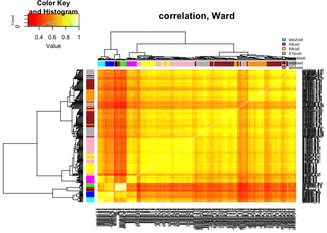

``` r
heatmap.2(C,ColSideColors=col.stage,RowSideColors=col.stage,
          Colv=as.dendrogram(hcl.corr2),Rowv=as.dendrogram(hcl.corr2),
          scale="none",trace="none",main="correlation, average")
legend("topright",stages,fill=coldef.stage,cex=0.5,bty='n',inset=c(0,-0.15,0,0))
```

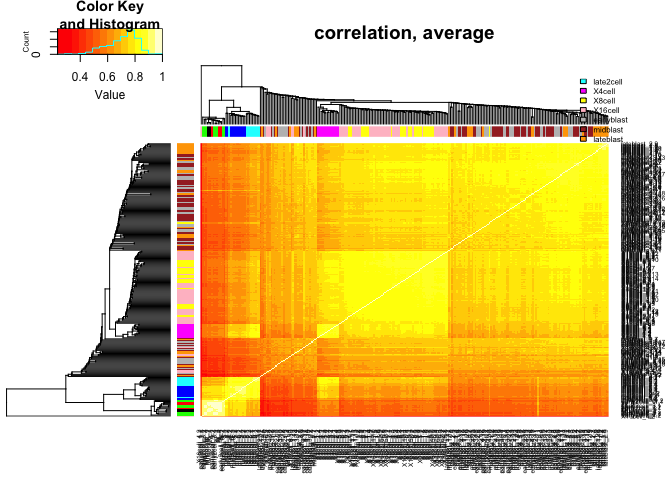

``` r
heatmap.2(C,ColSideColors=col.stage,RowSideColors=col.stage,
          Colv=as.dendrogram(hcl.euk),Rowv=as.dendrogram(hcl.euk),
          scale="none",trace="none",main="euklidean distance, Ward")
legend("topright",stages,fill=coldef.stage,cex=0.5,bty='n',inset=c(0,-0.15,0,0))
```

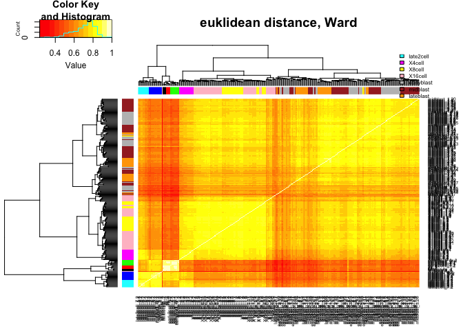

Another common clustering method is K-means clustering, lets try that as well, with a few different settings for k:

``` r
km7<-kmeans(log2(t(DATA)+1),7)
km10<-kmeans(log2(t(DATA)+1),10)
km15<-kmeans(log2(t(DATA)+1),15)
```

### Plot the clusters from hierarchical clustering in PCA-space

To get clusters from a hierarchical clustering we have to cut the branches of the dendrogram, this is done with the function "cutree", either with desired number of final clusters, or the height for cutting.

``` r
# Split the different hclust objects into 7 clusters:
clusters.corr<-cutree(hcl.corr,7)
clusters.corr2<-cutree(hcl.corr2,7)
clusters.euk<-cutree(hcl.euk,7)
    
#Now, lets plot them onto PCA-space, with PC1+PC2:
# the default palette in R only has 8 colors, so we need to update it with more colors.
palette(c("black","red","green3","blue","cyan","magenta", "yellow","orange",
          "brown","pink","darkgreen","darkviolet","darkgray","lightblue","lightgray"))

par(mfrow=c(3,2),mar=c(1,1,4,1))
pca.plot(PC,col=clusters.corr,main="clusters from correlation,Ward",selpc=1:2)
pca.plot(PC,col=clusters.corr2,main="clusters from correlation,average",selpc=1:2)
pca.plot(PC,col=clusters.euk,main="clusters from euklidean dist,Ward",selpc=1:2)
pca.plot(PC,col=km7$cluster,main="clusters from k-means, 7",selpc=1:2)
pca.plot(PC,col=km10$cluster,main="clusters from k-means, 10",selpc=1:2)
pca.plot(PC,col=km15$cluster,main="clusters from k-means, 15",selpc=1:2)
```

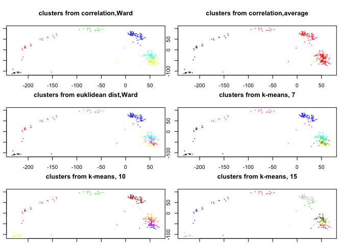

Using the hcl.corr object (based on pairwise correlations and Ward distance) how many clusters do you think are optimal? How many clusters do we need to cut the dendrogram into to separate out mid/late 2-cell? Does this clustering make sense?

Test some different cutoffs with:

``` r
par(mfrow=c(3,3),mar=c(1,1,4,1))
pca.plot(PC,col=col.stage,pch=pch.embryo,main="first PCA")
legend("topleft",stages,col=coldef.stage,pch=16,cex=0.3,bty='n')
for (ncl in c(5,7,10,15,20,25,30,40)){
    clusters.corr<-cutree(hcl.corr,ncl)
    pca.plot(PC,col=clusters.corr,main=sprintf("%d clusters",ncl),selpc=1:2)
}
```


Otimal would be to use bootstrapping when deciding on how many clusters to split the data on, and also for selecting the settings for clustering. But that takes a long time to run. The pvclust R-package can do bootsrapping for correlation based hierarchical clustering.

### PCA or MDS

Classical MDS (based on euklidean distances) should be identical to PCA, so let's run both and compare

``` r
#classical MDS using the distance matrix we created before:
fit.euk <- cmdscale(dist.euk, eig = TRUE, k = 2)
# or based on the correlation distance matrix:
fit.corr <- cmdscale(dist.corr, eig = TRUE, k = 2)
    
#Now lets plot all of them and compare:
    
par(mfrow=c(2,2),mar=c(1,1,4,1))
pca.plot(PC,col=col.stage,pch=pch.embryo,main="first PCA")
plot(fit.euk$points,col=col.stage,pch=pch.embryo,main="MDS euklidean")
plot(fit.corr$points,col=col.stage,pch=pch.embryo,main="MDS correlation")
```

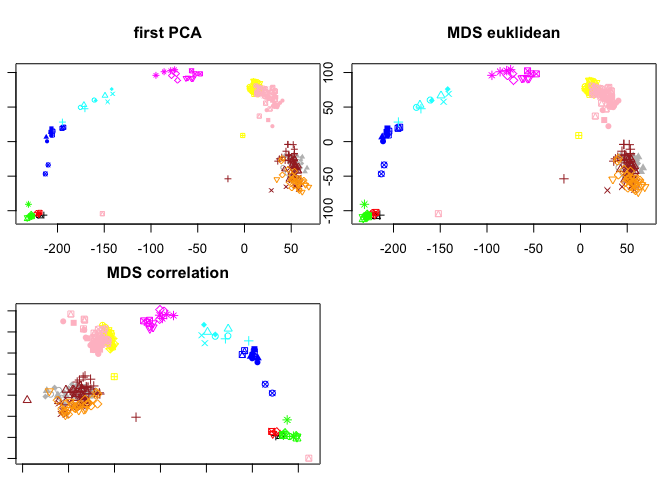

### tSNE

t-distributed stochastic neighbor embedding is a dimensionality reduction technique that is often used for scRNA-seq data. Here we will use the R-package Rtsne.

From the previous PCA plots we saw that the contribution from each principal component flattened out at around 7 PCs, so we only use the first 7 PCs in the tSNE.

``` r
library(Rtsne) 
# if you rerun the same tsne the results will be slightly 
# different if you do not set the random seed in R 
set.seed(1)
# run tSNE, on logged and transposed data
tsne.out <- Rtsne(t(log2(DATA+1)),initial_dims=7,perplexity=30)

# plot the results
plot(tsne.out$Y,col=col.stage,pch=pch.embryo,main="tSNE")
legend("topleft",stages,col=coldef.stage,pch=16,cex=0.5,bty='n')
```


In tSNE the initial\_dims (number of PCs to include), and the perplexity parameter may have a big influence on the results. Test a few different settings for these parameters.

``` r
set.seed(1)
tsne.d50 <- Rtsne(t(log2(DATA+1)),initial_dims=50,perplexity=30)
tsne.d3 <- Rtsne(t(log2(DATA+1)),initial_dims=3,perplexity=30)
tsne.p10 <- Rtsne(t(log2(DATA+1)),initial_dims=7,perplexity=10)
tsne.p50 <- Rtsne(t(log2(DATA+1)),initial_dims=7,perplexity=50)

# plot the results
par(mfrow=c(2,3),mar=c(1,1,4,1))
plot(tsne.out$Y,col=col.stage,pch=pch.embryo,main="id=7,p=30")
plot(tsne.d50$Y,col=col.stage,pch=pch.embryo,main="id=50,p=30")
plot(tsne.d3$Y,col=col.stage,pch=pch.embryo,main="id=3,p=30")
plot(tsne.p10$Y,col=col.stage,pch=pch.embryo,main="id=7,p=10")
plot(tsne.p50$Y,col=col.stage,pch=pch.embryo,main="id=7,p=50")
legend("topleft",stages,col=coldef.stage,pch=16,cex=0.5,bty='n')
```

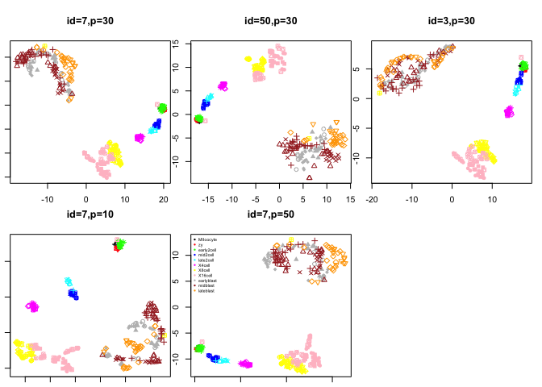

Look at the different tSNE layouts, can you explain based on the settings the different behaviours.

A good resource that can help you understand the parameters in tSNE is (Wahenberg, et al., "How to Use t-SNE Effectively”) <https://distill.pub/2016/misread-tsne/>.

##### Session info

``` r
sessionInfo()
```

    ## R version 3.4.1 (2017-06-30)
    ## Platform: x86_64-apple-darwin15.6.0 (64-bit)
    ## Running under: macOS Sierra 10.12.6
    ## 
    ## Matrix products: default
    ## BLAS: /Library/Frameworks/R.framework/Versions/3.4/Resources/lib/libRblas.0.dylib
    ## LAPACK: /Library/Frameworks/R.framework/Versions/3.4/Resources/lib/libRlapack.dylib
    ## 
    ## locale:
    ## [1] en_US.UTF-8/en_US.UTF-8/en_US.UTF-8/C/en_US.UTF-8/en_US.UTF-8
    ## 
    ## attached base packages:
    ## [1] stats     graphics  grDevices utils     datasets  methods   base     
    ## 
    ## other attached packages:
    ## [1] Rtsne_0.13   gplots_3.0.1 plotrix_3.7 
    ## 
    ## loaded via a namespace (and not attached):
    ##  [1] Rcpp_0.12.15       gtools_3.5.0       digest_0.6.15     
    ##  [4] rprojroot_1.3-2    bitops_1.0-6       backports_1.1.2   
    ##  [7] magrittr_1.5       evaluate_0.10.1    KernSmooth_2.23-15
    ## [10] stringi_1.1.6      gdata_2.18.0       rmarkdown_1.8     
    ## [13] tools_3.4.1        stringr_1.2.0      yaml_2.1.16       
    ## [16] compiler_3.4.1     caTools_1.17.1     htmltools_0.3.6   
    ## [19] knitr_1.19
